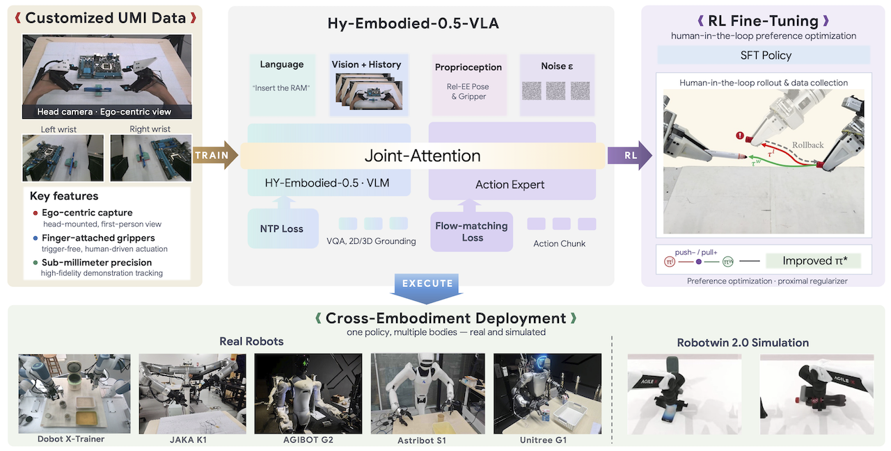
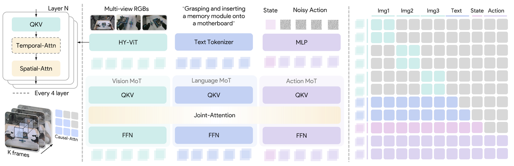
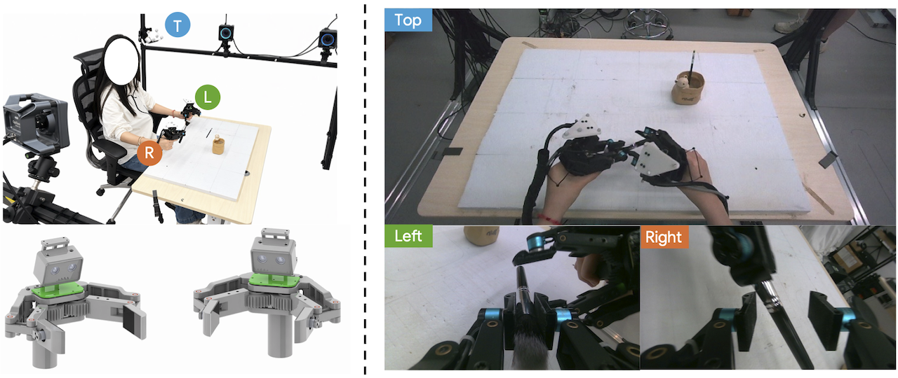

<div align="center">
<h1>Hy-Embodied-0.5-VLA</h1>
<p><b>From Vision-Language-Action Models to a Real-World Robot Learning Stack</b></p>
<p><i>Tencent Robotics X × Tencent Hy Team</i></p>

<a href="https://tairos.tencent.com/openSourceModels/hy-embodied-0.5-vla"></a>
<a href="https://arxiv.org/abs/2606.14409"></a>
<a href="https://github.com/Tencent-Hunyuan/Hy-Embodied-0.5-VLA"></a>
<br>
<a href="https://huggingface.co/tencent/Hy-Embodied-0.5-VLA-UMI"></a>
<a href="https://modelscope.cn/models/Tencent-Hunyuan/Hy-Embodied-0.5-VLA-RoboTwin"></a>
<a href="https://huggingface.co/datasets/tencent/Hy-Embodied-0.5-VLA-Data"></a>
<a href="https://modelscope.cn/datasets/Tencent-HunYuan/Hy-Embodied-0.5-VLA-Data"></a>
</div>

https://github.com/user-attachments/assets/fdd1966c-8453-4f6a-9758-238076d08ac4

## 🔥 Updates

* **`[2026-06-16]`** 🌐 Added ModelScope links for all models and data.
* **`[2026-06-15]`** 🚀 We have released **Hy-Embodied-0.5-VLA** — including the codebase, the [`Hy-Embodied-0.5-VLA-UMI`](https://huggingface.co/tencent/Hy-Embodied-0.5-VLA-UMI) ([ModelScope](https://modelscope.cn/models/Tencent-Hunyuan/Hy-Embodied-0.5-VLA-UMI)) and [`Hy-Embodied-0.5-VLA-RoboTwin`](https://huggingface.co/tencent/Hy-Embodied-0.5-VLA-RoboTwin) ([ModelScope](https://modelscope.cn/models/Tencent-Hunyuan/Hy-Embodied-0.5-VLA-RoboTwin)) models, and the [`Hy-Embodied-0.5-VLA-Data`](https://huggingface.co/datasets/tencent/Hy-Embodied-0.5-VLA-Data) egocentric UMI dataset (2K+ hours)!

## 📖 Abstract

We introduce **Hy-Embodied-0.5-VLA (Hy-VLA)** — an end-to-end Vision-Language-Action system that spans the full robot learning stack: data collection, model design, pre-training, supervised fine-tuning, RL post-training, and real-world deployment. Built on the [Hy-Embodied-0.5](https://github.com/Tencent-Hunyuan/HY-Embodied) MoT backbone, Hy-VLA integrates a flow-matching action expert, a compact memory encoder for multi-frame history, and a delta-chunk action representation decoupled from embodiment-specific kinematics.

Powered by **10,000+ hours** of high-fidelity UMI demonstrations collected via a custom fingertip interface with optical motion-capture, Hy-VLA achieves state-of-the-art results on the RoboTwin 2.0 benchmark (**90.9% / 90.1%** on Clean / Randomized) and demonstrates robust cross-embodiment transfer across four real-world robot platforms. Paired with [FlowPRO](https://wuyeyexvnainai.github.io/flowpro/) preference optimization and an asynchronous inference framework, Hy-VLA establishes a scalable paradigm for continuous dexterous manipulation.

<div align="center">

</div>

## ⭐ Key Features

  * 🧠 **Unified VLA Architecture:** Extends the Hy-Embodied-0.5 MoT backbone with a dual-tower flow-matching action expert. The VLM tower handles vision-language understanding while the action expert generates continuous action chunks — all tied together through shared cross-modal attention.
  * 🎯 **Delta-Chunk Action Representation:** Actions are predicted as relative-to-current-frame end-effector delta chunks, decoupling the policy from embodiment-specific kinematics and enabling seamless cross-embodiment transfer.
  * 📹 **Compact Memory Encoder:** A parameter-free temporal-spatial attention mechanism interleaved within the ViT encoder compresses K-frame multi-view history into current-frame tokens, preserving temporal context without inflating the token budget.
  * 📊 **Hy-UMI-10K Dataset:** 10K+ hours of sub-millimeter precision dual-arm demonstrations across 70+ tasks, collected with a custom fingertip UMI rig tracked by an optical motion-capture system. 2K+ hours are publicly released.
  * 🚀 **FlowPRO Post-Training** *(under review)*: A critic-free preference optimization algorithm that converts real-robot failure interventions into rapid policy improvement without reward models.
  * ⚡ **Asynchronous Deployment Stack:** Producer-consumer inference with cubic Bézier chunk stitching enables high-frequency closed-loop control across heterogeneous robot platforms.

## 📦 Repository Contents

```
Hy-Embodied-0.5-VLA/
├── hy_vla/                      # Core model definition, training, and inference
│   ├── modeling_hy_vla.py       # HyVLA model class
│   ├── modeling_dual_tower.py   # Dual-tower transformer (VLM + action expert)
│   ├── configuration_hy_vla.py  # Model configuration
│   ├── space_time_attention.py  # Temporal-spatial attention for memory encoder
│   ├── data/                    # Dataloader and dataset utilities
│   ├── config/                  # YAML configuration files
│   └── hunyuan_vl_mot/          # Vendored Hy-Embodied VLM backbone (fallback)
├── scripts/                     # Training, evaluation, and preprocessing scripts
│   ├── quick_start.py           # Fast smoke-test for a released checkpoint
│   ├── train_umi_vlm.sh         # Stage-1 pre-training launcher
│   ├── train_robotwin_vlm.sh    # Stage-2 SFT from VLM backbone
│   ├── train_robotwin_umi.sh    # Stage-2 SFT from UMI pretrain
│   ├── train_table_vlm.sh       # Single-table fast-iteration training
│   ├── eval_robotwin_test.sh    # Quick RoboTwin regression (6 tasks)
│   ├── eval_robotwin_full.sh    # Full RoboTwin sweep (50 tasks × 100 rollouts)
│   ├── compute_norm_lance.py    # Pre-compute norm stats from Lance data
│   ├── compute_norm_hdf5.py     # Pre-compute norm stats from HDF5 data
│   └── vis_umi_episode.py       # Render an episode as MP4
├── robotwin_eval/               # RoboTwin adapter for evaluation
├── assets/                      # Example data and index files
└── pyproject.toml               # Python project configuration (uv/pip)
```

## 🛠️ Installation

### Prerequisites

- 🖥️ **OS**: Linux (recommended)
- 🐍 **Python**: 3.12 (recommended and tested)
- ⚡ **CUDA**: 12.x
- 🔥 **PyTorch**: ≥ 2.4
- 🎮 **GPU**: NVIDIA GPU with CUDA support (≥ 16 GB VRAM recommended)

### Install via uv (recommended)

```bash
git clone https://github.com/Tencent-Hunyuan/Hy-Embodied-0.5-VLA
cd Hy-Embodied-0.5-VLA

# One-off: install uv
curl -LsSf https://astral.sh/uv/install.sh | sh

# Materialize the virtual environment
uv sync
```

### Install via pip

```bash
pip install -r requirements.txt
```

> **Note**: Hy-VLA depends on an upstream `transformers` fork that supports the Hy-Embodied MoT backbone. The pinned commit is specified in both `requirements.txt` and `pyproject.toml`. If the fork URL is unreachable, a verbatim vendor copy at `hy_vla/hunyuan_vl_mot/` serves as fallback.

## 🚀 Quick Start

The fastest way to verify a fresh install is the bundled smoke test:

```python
import torch
from huggingface_hub import snapshot_download
from hy_vla import HyVLA, HyVLAConfig

ckpt = snapshot_download("tencent/Hy-Embodied-0.5-VLA-RoboTwin")

config = HyVLAConfig.from_pretrained(ckpt)
policy = HyVLA.from_pretrained(ckpt, config=config)
policy.enable_video_encoder_if_needed()
policy = policy.to(device="cuda", dtype=torch.bfloat16).eval()

# (B, K, C, H, W); K=6 history slots
img = torch.zeros(1, 6, 3, 224, 224, device="cuda", dtype=torch.bfloat16)
# Normalized dual-arm EEF: [xyz(3) + rot6d(6) + gripper(1)] * 2
state = torch.zeros((1, config.max_state_dim), device="cuda", dtype=torch.bfloat16)
batch = {
    "observation.images.top_head":   img,
    "observation.images.hand_left":  img,
    "observation.images.hand_right": img,
    "observation.state": state,
    "task": ["pick up the bottle"],
}

with torch.no_grad():
    actions = policy.forward_evaluate(batch)["pred"]
    actions = actions[..., : config.action_feature.shape[0]]
print(actions.shape)
```

Or simply:

```bash
python scripts/quick_start.py
```

## 🤖 Model

Hy-VLA follows the Vision-Language-Action paradigm built on three components:

<div align="center">

</div>

**Backbone — Hy-Embodied-0.5 MoT.** A Mixture-of-Transformers architecture with modality-adaptive computation. Visual tokens are routed through dedicated vision-specific parameters while text tokens use the original language parameters; cross-modal interaction is limited to shared self-attention layers. The backbone encodes images at native resolution via Hy-ViT 2.0.

**Action Expert — Dual-Tower Flow Matching.** Rather than discretizing actions into language tokens, a dedicated 370M-parameter action expert models the continuous action distribution via conditional flow matching. The VLM tower and action expert tower share attention, allowing grounded vision-language context to guide continuous action generation. At inference, actions are generated by integrating the learned velocity field over 10 Euler steps with KV-cached observation prefixes.

**Compact Memory Encoder.** Interleaved temporal-spatial attention within the ViT encoder compresses K-frame multi-view history. Temporal attention (causal across frames) and spatial attention (bidirectional within each frame) reuse the same QKV projections — zero new parameters relative to the single-image encoder. Past-frame tokens are discarded after temporal mixing, keeping the VLM token count constant regardless of history length.

### Released Checkpoints

| Model | HuggingFace | ModelScope | Description |
|---|---|---|---|
| **Hy-VLA-UMI** | [`tencent/Hy-Embodied-0.5-VLA-UMI`](https://huggingface.co/tencent/Hy-Embodied-0.5-VLA-UMI) | [`Tencent-Hunyuan/Hy-Embodied-0.5-VLA-UMI`](https://modelscope.cn/models/Tencent-Hunyuan/Hy-Embodied-0.5-VLA-UMI) | Pre-trained on the Hy-UMI-10K corpus; intended as a generalist starting point for fine-tuning |
| **Hy-VLA-RoboTwin** | [`tencent/Hy-Embodied-0.5-VLA-RoboTwin`](https://huggingface.co/tencent/Hy-Embodied-0.5-VLA-RoboTwin) | [`Tencent-Hunyuan/Hy-Embodied-0.5-VLA-RoboTwin`](https://modelscope.cn/models/Tencent-Hunyuan/Hy-Embodied-0.5-VLA-RoboTwin) | Post-trained on the RoboTwin 2.0 50-task benchmark |

Both checkpoints are self-contained — they ship their own `tokenizer.json`, `vlm_config_dict`, `chat_template.jinja`, and pre-computed normalization statistics (`norm_stats.pkl`). If needed, you can regenerate normalization stats on your own data using `scripts/compute_norm_lance.py`.

## 📊 Data

Hy-VLA is pre-trained on **Hy-Embodied-0.5-VLA-Data**, a large-scale bimanual manipulation dataset with **250K+ episodes** spanning **10K+ hours** of dual-arm teleoperation trajectories, wiht **2K+ hours** released. The open-source release contains approximately one-fifth of the full training corpus, partitioned into 22 Lance-format tables compatible with [LeRobot](https://github.com/huggingface/lerobot) v3.0.

| Attribute | Value |
|---|---|
| Format | Lance (LeRobot v3.0 schema) |
| Resolution | 240 × 424 px |
| Cameras | `cam_high` (head), `cam_left_wrist`, `cam_right_wrist` |
| State | 16-dim dual-arm EEF (pos + quat + gripper per arm) |
| FPS | 30 |
| Total Episodes | 250K+ |
| Total Duration | 2000+ hours |

<div align="center">

</div>

### Data Loading Quick Start

`LanceTableReader` reads a single Lance table (local or HF Hub):

```python
from hy_vla.data.lance_dataset import LanceTableReader

# Local directory
reader = LanceTableReader(root="./table_000")

# HF Hub
reader = LanceTableReader(
    repo_id="tencent/Hy-Embodied-0.5-VLA-Data",
    table_name="table_000",
)

# Access
frame = reader[42]                        # single frame dict
episode = reader.get_episode(3)           # all frames of episode 3
```

> Also compatible with raw `lance`, `lancedb`, and [`lerobot-lancedb`](https://github.com/lancedb/lerobot-lancedb) (`LeRobotLanceDataset`).

### Example Episode Visualization

https://github.com/user-attachments/assets/b4b8d807-4bc1-4c4d-9b3d-b7d674a4e251

You can render any episode locally:

```bash
# Use the HF Hub dataset, pick table_000 episode 666
python scripts/vis_umi_episode.py -t table_000 -e 666

# Local Lance root
python scripts/vis_umi_episode.py /path/to/Hy-Embodied-0.5-Data -e 0 --no-3d
```

## 🏋️ Training & Evaluation

Hy-VLA supports multiple training workflows, each with corresponding evaluation results.

### Pre-training

The VLM tower is initialized from `tencent/HY-Embodied-0.5` and the action expert is randomly initialized. Training uses the full 10K-hour UMI corpus under the flow-matching objective (Eq. 1) with history length K=1 and action chunk horizon H=50 at 10 Hz. The model is trained for 200K steps with a global batch size of 1,024.

```bash
# Single-table fast iteration
export TABLE_NAME=table_001
bash scripts/train_table_vlm.sh

# Full corpus (64 GPUs)
export CHIEF_IP=<chief-ip> INDEX=0
bash scripts/train_umi_vlm.sh
```

### Supervised Fine-Tuning

Starting from the pre-trained checkpoint, SFT activates the compact memory encoder (K=6 frames) and fine-tunes on task-specific demonstrations. For real-world deployment, we train for 60K steps with batch size 32; for [RoboTwin 2.0](https://github.com/robotwin-Platform/RoboTwin), we use batch size 128 with action downsampling (stride 3).

```bash
# --- Training ---
export CHIEF_IP=<chief-ip> INDEX=0
bash scripts/train_robotwin_umi.sh   # Fine-tune from Hy-VLA-UMI on RoboTwin

# --- Evaluation ---
export ROBOTWIN_DIR=/path/to/RoboTwin
export CKPT_PATH=tencent/Hy-Embodied-0.5-VLA-RoboTwin

# Quick regression (6 tasks × 10 rollouts)
bash scripts/eval_robotwin_test.sh

# Full sweep (50 tasks × 100 rollouts, 8 GPUs)
bash scripts/eval_robotwin_full.sh
```

> **Note:** The eval scripts automatically symlink `Hy-VLA/robotwin_eval/` → `RoboTwin/policy/hy_vla`, so that RoboTwin's `eval_policy.py` can discover the Hy-VLA policy adapter without any manual configuration.

#### RoboTwin 2.0 — Simulated Bimanual Manipulation

| Method | Clean | Randomized |
|---|---|---|
| π₀ | 65.9 | 58.4 |
| ABot-M0 | 81.2 | 80.4 |
| π₀.₅ | 82.7 | 76.8 |
| Qwen-VLA | 86.1 | 87.2 |
| LingBot-VLA | 86.5 | 85.3 |
| starVLA | 88.2 | 88.3 |
| Motus | 88.7 | 87.0 |
| JoyAI-RA | 90.5 | 89.3 |
| **Hy-VLA** | **90.9** | **90.1** |

*Success rate (%) averaged over 100 rollouts per task × 50 tasks. Best in **bold**.*

We validate SFT across two deployment tracks:
- **Track A (Intra-Embodiment):** Fine-tune and evaluate on the same robot (Dobot X-Trainer, 4 tasks)
- **Track B (Cross-Embodiment):** Fine-tune only on UMI demonstrations and deploy to morphologically different robots (JAKA K1, Astribot S1)

#### Track A — X-Trainer Real-World Tasks

| Method | Set the Table | Fold & Store Glasses | Zip Up the Pen Case | Insert Bottles |
|---|---|---|---|---|
| π₀ | 79% | 67% | 48% | 80% |
| π₀.₅ | 88% | 75% | 57% | 84% |
| Hy-Embodied (w/o UMI pretrain) | 80% | 65% | 43% | 70% |
| **Hy-VLA (Ours)** | **83%** | **94%** | **73%** | **94%** |

*Four bimanual tasks on the Dobot X-Trainer. UMI pre-training provides significant gains on precision-critical tasks (glasses folding, zipper manipulation) compared to the baseline without UMI data.*

#### Track B — Cross-Embodiment Transfer

| Method | JAKA K1 · Organize Accessory | Astribot S1 · Clean Up Table |
|---|---|---|
| π₀ | 88% | 87% |
| π₀.₅ | 81% | 89% |
| Hy-Embodied (w/o UMI pretrain) | 38% | 44% |
| **Hy-VLA (Ours)** | **90%** | **89%** |

*Cross-embodiment deployment to JAKA K1 and Astribot S1, fine-tuned only on UMI demonstrations without any target-robot teleoperation data. The ablation without UMI pre-training collapses, confirming that the large-scale UMI corpus is essential for embodiment-agnostic action priors.*

### RL Post-Training with FlowPRO

Beyond standard SFT, Hy-VLA supports **FlowPRO** — a critic-free preference optimization algorithm *(under review, code coming soon)* that converts real-robot failure interventions into policy improvement. The RPRO loss directly contrasts preferred and dispreferred action chunks per state, with a symmetric proximal regularizer that prevents reward hacking.

FlowPRO operates iteratively:
1. **Collect** preference pairs via teleoperated intervention-and-rollback
2. **Convert** sparse corrections into dense per-state tuples via Smooth Interpolation
3. **Optimize** with the RPRO loss on mixed batches

#### FlowPRO Results — X-Trainer Real-World Tasks

| Method | Bottle | Cap | USB | Zip |
|---|---|---|---|---|
| DAgger | 93 ± 2.1% / 27s | 88 ± 1.8% / 29s | 86 ± 2.4% / 25s | 83 ± 2.0% / 55s |
| π₀.₆* | 95 ± 1.5% / 24s | 95 ± 1.2% / 27s | 95 ± 1.4% / 23s | 89 ± 1.6% / 45s |
| **RPRO (Ours)** | **99 ± 0.6% / 16s** | **99 ± 0.7% / 21s** | **98 ± 0.9% / 22s** | **94 ± 1.1% / 37s** |

*Success rate (mean ± std over 3 seeds, 100 rollouts each) and mean completion time after K=3 rounds of post-training on four X-Trainer bimanual tasks. RPRO achieves near-ceiling success rates with substantially shorter completion times.*

### Pre-Computing Normalization Statistics

Required before the first training run:

```bash
python scripts/compute_norm_lance.py \
    --lance-source tencent/Hy-Embodied-0.5-VLA-Data \
    --output norm_stats.pkl
```

> The released checkpoints already ship with pre-computed norm stats. Use this script only if you are training on custom data.

## 🙏 Acknowledgements

We thank the Hugging Face and LeRobot communities for their infrastructure and tooling. This work builds upon [Hy-Embodied-0.5](https://github.com/Tencent-Hunyuan/HY-Embodied), [FlowPRO](https://wuyeyexvnainai.github.io/flowpro/), and the [RoboTwin 2.0](https://github.com/robotwin-Platform/RoboTwin) benchmark.

## 📚 Citation

If you find Hy-VLA useful for your research, please cite:

```bibtex
@article{tencent2026hyembodied05vla,
  title={Hy-Embodied-0.5-VLA: From Vision-Language-Action Models to a Real-World Robot Learning Stack},
  author={Tencent Robotics X and Tencent Hy Team},
  journal={arXiv preprint arXiv:2606.14409},
  year={2026}
}
```

## 📜 License

Released under the **Apache-2.0 License**. See [LICENSE](https://github.com/Tencent-Hunyuan/Hy-Embodied-0.5-VLA/blob/main/LICENSE) for full terms.
